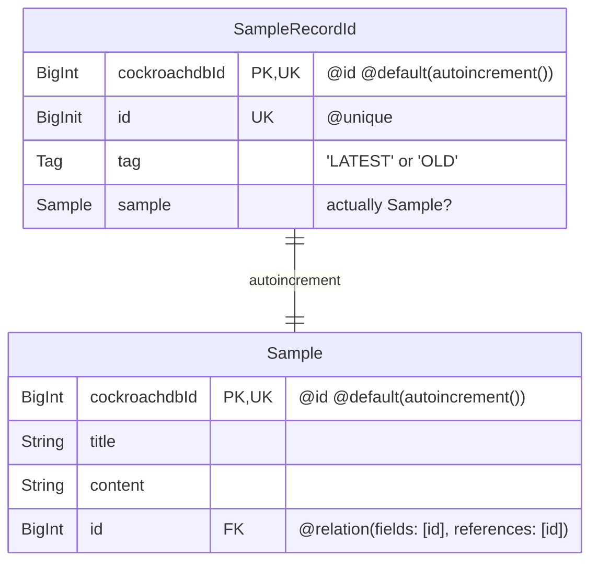

# CockroachDB × Prisma

## Setup

```shell
yarn
yarn compile
yarn migrate
yarn init:prisma
```

# CRUD 操作

1. `index.ts`に操作内容を書く

2. 以下のコマンド実行

```shell
yarn compile
yarn start
```

# テーブル構造


```mermaid
erDiagram
    SampleRecordId ||--|| Sample : autoincrement
    SampleRecordId {
        BigInt cockroachdbId PK, UK "@id @default(autoincrement())"
        BigInit id UK "@unique"
        Tag tag "'LATEST' or 'OLD'"
        Sample sample "actually Sample?"
    }
    Sample {
        BigInt cockroachdbId PK, UK "@id @default(autoincrement())"
        String title
        String content
        BigInt id FK "@relation(fields: [id], references: [id])"
    }
```
